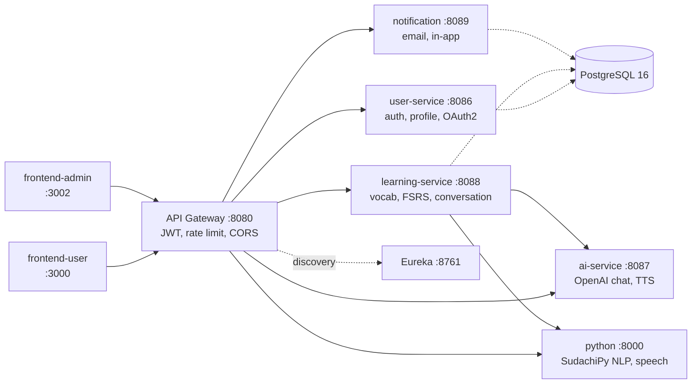
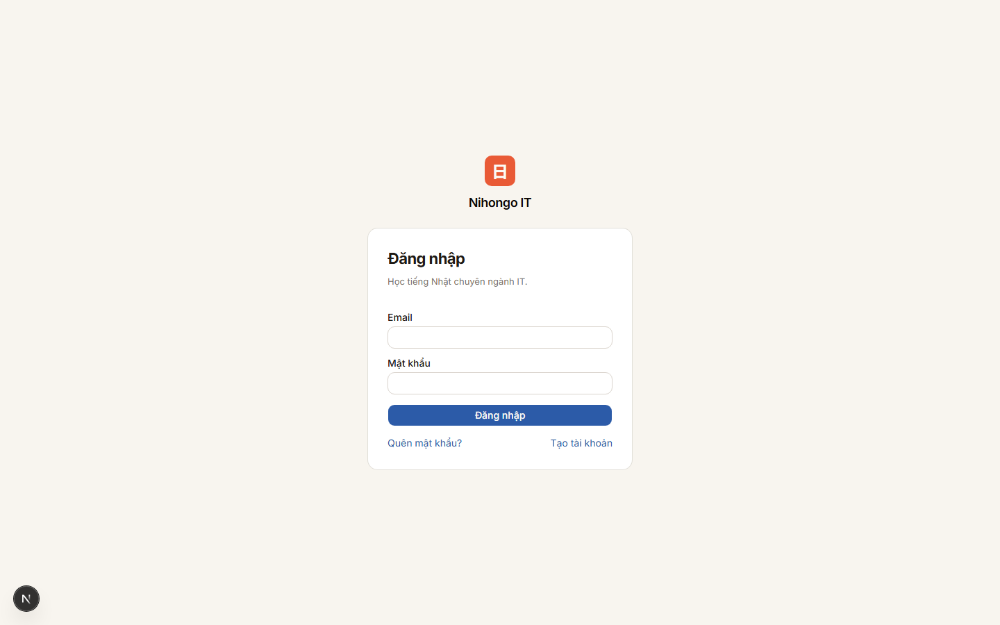
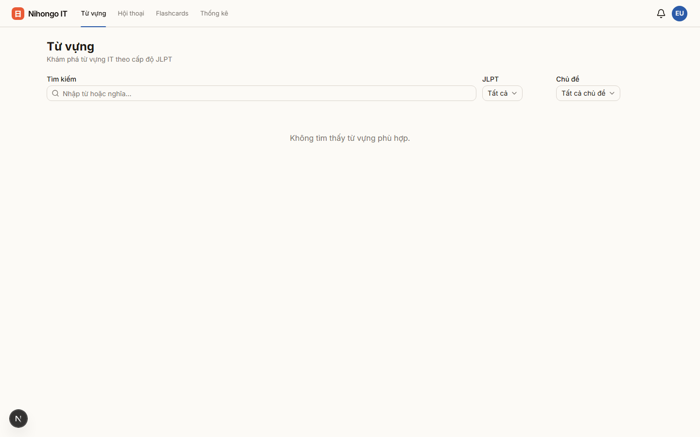
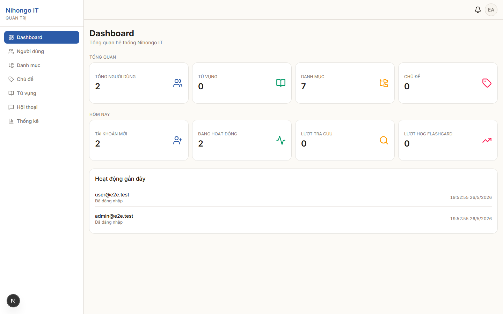

# Nihongo IT

[](https://github.com/ndtung723/nihongo-it/actions/workflows/backend.yml)
[](https://github.com/ndtung723/nihongo-it/actions/workflows/frontend.yml)
[](https://github.com/ndtung723/nihongo-it/actions/workflows/e2e.yml)
[](https://github.com/ndtung723/nihongo-it/actions/workflows/codeql.yml)

A Japanese learning platform for Vietnamese IT professionals — vocabulary, flashcards with FSRS spaced repetition, conversation practice, and AI-powered pronunciation analysis. Built as a Kotlin/Spring Boot microservice backend with two standalone Next.js 16 frontends (learner + admin), wrapped in a custom "Wabi" design system and validated end-to-end by a self-healing Playwright suite.

---

## Architecture



The gateway is the only public entry point. It validates JWTs once and injects `X-User-Id`, `X-Role`, `X-Email` headers downstream — services never re-verify tokens. All services register with Eureka; Bucket4j enforces per-route rate limits (login 5/min, AI 30/min, speech 10/min).

---

## Tech stack

| Layer        | Stack                                                                                                                                                |
| ------------ | ---------------------------------------------------------------------------------------------------------------------------------------------------- |
| Backend      | Kotlin 2.3.0, Spring Boot 4.0.2, Spring Cloud 2025.1.1, Spring Security 7, Spring Cloud Gateway, Netflix Eureka, OpenFeign, JDK 25, Gradle 9.3 (KTS) |
| Persistence  | PostgreSQL 16, Flyway, HikariCP, Spring Data JPA (auditing via `AbstractAuditEntity`)                                                                |
| Frontend     | Next.js 16 (App Router), React 19, TypeScript 5, Tailwind CSS 4, shadcn/ui (Radix), Zustand, react-hook-form + zod, sonner, chart.js, lucide-react   |
| Admin extras | @tanstack/react-table v8, @dnd-kit/sortable, react-day-picker, cmdk                                                                                  |
| AI / NLP     | OpenAI (GPT, TTS), FastAPI, SudachiPy (Japanese morphological analysis), pronunciation scoring (pitch + formants)                                    |
| Auth         | JWT (access 2h, refresh 14d with rotation), httpOnly refresh cookie + in-memory access token, Google OAuth2 (`@react-oauth/google`)                  |
| Testing      | Playwright (e2e, 50 specs), Vitest + React Testing Library (FE), JUnit 5 + Mockito-Kotlin + Jacoco (BE), pytest (Python)                             |
| Observability| Structured JSON logs (Logstash encoder), correlation ID propagation, Prometheus, Grafana, Loki + Promtail, Tempo                                     |
| CI           | GitHub Actions — Backend (matrix per service), Frontend (matrix per app), E2E (Playwright smoke on PR + nightly full), CodeQL, gitleaks              |

---

## Feature highlights

- **AI-powered learning loop** — flashcards driven by FSRS (Free Spaced Repetition Scheduler); the OpenAI-backed `ai-service` powers conversational practice and TTS playback.
- **Pronunciation analysis** — record audio in-browser via `MediaRecorder`; the Python FastAPI service runs SudachiPy tokenization, extracts pitch and formants, and returns a per-mora score.
- **"Wabi" design system** — a two-colour brand built on _Ai-iro_ (藍色 indigo) + _Shu-iro_ (朱色 vermillion) over a _Washi_ paper neutral ramp. Inter + Noto Sans/Serif JP + JetBrains Mono. JLPT levels (N5–N1) map to fixed chromas applied consistently across vocab badges, filters, and charts. See [`docs/design-system/`](docs/design-system/README.md).
- **Centralized gateway auth** — services trust signed gateway headers and read the current user via a shared `AuthenticationUtils` helper from the `common` module.
- **Self-healing E2E suite** — Playwright tests are authored by a Planner agent, generated by a Generator agent, and repaired by a Healer agent when selectors drift. See [`docs/plans/2026-05-21-playwright-e2e-plan.md`](docs/plans/2026-05-21-playwright-e2e-plan.md).
- **Production-realistic E2E** — the CI E2E job applies real Flyway migrations to a fresh Postgres service container and runs services with `ddl-auto=validate`, catching schema drift before merge.

---

## Screenshots

| Login                                                              | Vocabulary                                                                    | Admin dashboard                                                                       |
| ------------------------------------------------------------------ | ----------------------------------------------------------------------------- | ------------------------------------------------------------------------------------- |
|               |               |             |

More screens in [`docs/mockups/02-screens-migration/`](docs/mockups/02-screens-migration/): home, register, flashcards-study, conversation, statistics, profile, admin-users, admin-vocabulary.

---

## Getting started

### Prerequisites

- Docker Desktop
- Node.js 24+ (for running frontends locally)
- JDK 25 (for compiling backend locally — not required if you only run via Docker)

### 1. Configure environment

```bash
cp docker/.env.example docker/.env
# Fill: DB_PASSWORD, JWT_SECRET (≥64 chars), OPENAI_API_KEY, MAIL_*, GOOGLE_CLIENT_*
```

### 2. Start the full stack

```bash
./scripts/setup.sh        # first-time only: downloads OTel agent, copies .env, brings everything up
make up                   # day-to-day: core + observability
make up MAKE_NO_O11Y=1    # core only (lighter — no Prometheus/Loki/Tempo/Grafana)
make down                 # stop, keep volumes
make reset                # stop + wipe volumes (destroys DB)
make logs SERVICE=user-service
make db DB=learning_service
```

Flyway runs on service startup and seeds initial schema.

### 3. Hot-reload frontends (optional)

```bash
cd frontend-user  && npm install && npm run dev   # http://localhost:3000
cd frontend-admin && npm install && npm run dev   # http://localhost:3001
```

### Ports

| Service          | URL                               |
| ---------------- | --------------------------------- |
| User app         | http://localhost:3000             |
| Admin app        | http://localhost:3002             |
| API Gateway      | http://localhost:8080             |
| Eureka dashboard | http://localhost:8761             |
| Grafana          | http://localhost:3001 (admin/admin) |
| Prometheus       | http://localhost:9090             |
| Tempo            | http://localhost:3200             |

### Swagger UI

`http://localhost:8086/swagger-ui.html` · `:8088` · `:8087` · `:8089`

---

## Project structure

```
nihongo-it/
├── services/                   # Backend Kotlin / Spring Boot microservices
│   ├── common/                 # Shared: BusinessException, GlobalExceptionHandler,
│   │                           # GatewayHeaderAuthFilter, AbstractAuditEntity, logging
│   ├── api-gateway/            # :8080  JWT validation, rate limiting, routing
│   ├── eureka-server/          # :8761  service discovery
│   ├── user-service/           # :8086  auth, profile, OAuth2 Google
│   ├── learning-service/       # :8088  vocab, flashcards, FSRS, conversation
│   ├── ai-service/             # :8087  OpenAI chat + TTS
│   └── notification/           # :8089  email + in-app notifications
├── frontend-user/              # Next.js 16 learner app — port 3000
├── frontend-admin/             # Next.js 16 admin app — port 3001 (dev) / 3002 (docker)
├── python/                     # FastAPI NLP + speech analysis
├── e2e/                        # Playwright suite (50 specs, Page Object Model)
├── docker/                     # docker-compose, Prometheus, Loki, Grafana provisioning
├── deploy/                     # GCP deploy scripts
├── docs/
│   ├── design-system/          # "Wabi" tokens, UI kits, brand assets
│   ├── mockups/                # Screen mockups + migration references
│   └── plans/                  # Phase plans, discoveries, roadmaps
├── .claude/                    # Skills + subagents for Claude Code
└── scripts/                    # setup.sh, helpers
```

Both Next.js apps are intentionally duplicated (types, api-client, services) — there is **no shared package**. This keeps each app deployable on its own and avoids monorepo build coupling.

---

## Development workflow

The user prefers **compile-only verification** — no `bootRun`, no dev server — to validate changes before commit.

```bash
# Backend (in /services)
./gradlew build -x test          # compile all modules, skip tests

# Frontend (per app)
cd frontend-user  && npm run type-check && npm run lint && npm run build
cd frontend-admin && npm run type-check && npm run lint && npm run build
```

Before commit: `type-check` + `lint` + `build` must pass on both apps. Unit tests (`npm test`) and backend tests (`./gradlew test`) run in CI.

Conventions enforced repo-wide (see [`CLAUDE.md`](CLAUDE.md) for the full list):

- Services do **not** re-validate JWTs — read `X-User-Id` injected by the gateway.
- All entities extend `AbstractAuditEntity`; migrations must include `created_at`/`created_by`/`updated_at`/`updated_by`.
- Kotlin non-null primitive entity columns need explicit `@Column(nullable = false)` (Hibernate strict validate does not infer it).
- Spring Boot 4 requires `spring-boot-starter-flyway` — `flyway-core` alone silently skips migrations.
- Frontend route protection lives in `proxy.ts` (renamed from `middleware.ts` in Next.js 16).
- Service files are `{name}.service.ts`; types are never inlined inside service files.
- Toasts go through `useAppToast()`, never `toast()` from sonner directly. Stores throw; components catch and toast.

---

## Testing

| Layer             | Suite                                   | Coverage                                                              |
| ----------------- | --------------------------------------- | --------------------------------------------------------------------- |
| Backend unit      | JUnit 5 + Mockito-Kotlin                | Jacoco gate at 15% line coverage (rising)                             |
| Frontend unit     | Vitest + React Testing Library          | 7 specs per app — auth flow, hooks, store actions                     |
| E2E               | Playwright (Chromium, headed in dev)    | 50 specs across user + admin (auth, vocab, flashcards, conv, admin CRUD, statistics) |
| Security / SAST   | CodeQL, gitleaks, OWASP dependency-check| All on GitHub Actions                                                 |

The E2E suite uses the three-agent pattern documented in [`docs/plans/2026-05-21-playwright-e2e-plan.md`](docs/plans/2026-05-21-playwright-e2e-plan.md):

1. **`playwright-test-planner`** — explores the live app and writes Markdown test specs.
2. **`playwright-test-generator`** — converts a Markdown spec into a runnable `.spec.ts` with Page Object Model selectors.
3. **`playwright-test-healer`** — diagnoses failures and auto-repairs selector / timing drift.

E2E in CI runs against a fresh Postgres service container; per-service databases are seeded by applying real Flyway migrations via `psql`, then the gateway, user/learning/notification services and both frontends boot from `bootJar`. `ai-service` is intentionally gated (Spring AI 1.0.0 is not yet SB4-compatible) — AI-touching tests are skipped unless `E2E_OPENAI` / `E2E_PYTHON_NLP` are set.

---

## Design system

The "Wabi" design system lives under [`docs/design-system/`](docs/design-system/README.md):

- **Colour** — Ai-iro (`#3a4ea0`) for primary, Shu-iro (`#d24a26`) sparingly for the brand mark / notifications, Washi paper neutrals (warm-leaning ramp). JLPT N5→N1 fixed chromas.
- **Type** — Inter (Latin/Vietnamese), Noto Sans JP (inline JP), Noto Serif JP (display JP), JetBrains Mono (code / tabular nums).
- **Motion** — restrained: 120ms hover, 180ms base, 320ms sheets, 500ms flashcard flip. No bounce, no parallax.
- **Icons** — `lucide-react`, stroke-only, 2px weight. No emoji anywhere.
- **Brand mark** — 日 in a vermillion or indigo rounded square (hanko-style).

Two reverse-engineerable UI kits ship under [`docs/design-system/ui_kits/{user,admin}/`](docs/design-system/ui_kits/) with interactive HTML previews.

---

## AI-assisted development

This repo is built and maintained with Claude Code. Domain knowledge is encoded as reusable assets:

- **Skills** (`.claude/skills/`): `backend-microservice`, `build-and-verify`, `feature-implementation-workflow`, `playwright-e2e` — each is a SKILL.md that tells the agent how to work in that layer.
- **Subagents** (`.claude/agents/`): `playwright-test-planner`, `playwright-test-generator`, `playwright-test-healer` — the three-agent loop that owns the E2E suite.
- **Plans** (`docs/plans/`): every multi-phase initiative is captured with goals, non-goals, phase rollout, and a "Discoveries" log of quirks found mid-flight.
- **Project memory** ([`CLAUDE.md`](CLAUDE.md)): the canonical conventions doc — overrides, anti-patterns, daily workflow.

---

## Project status

- **Backend**: 6 sprints landed — common module, rate limiting, structured logging, monitoring, cleanup, notification API. Migrated to Kotlin 2.3 + Spring Boot 4 + JDK 25.
- **Frontend**: Vue → Next.js 16 migration complete. `frontend-user` has 21 routes, `frontend-admin` has 14. Full feature parity with the previous Vue app.
- **Design system**: "Wabi" tokens adopted across both apps (commits D-A1 → D-B3). Conversation, statistics, vocabulary, and full admin shell migrated.
- **E2E**: 9 phases (P1 → P9). 50 specs green in CI smoke. P9 hardened the suite against production-realistic schema validation.
- **Up next**: UX & engagement improvements F1–F15 — see [`docs/plans/2026-05-26-ux-improvements.md`](docs/plans/2026-05-26-ux-improvements.md) (Today dashboard, streak / daily plan, type-to-answer, AI roleplay, voice conversation, PWA install).

---

## Environment variables

| Variable                                     | Purpose                                                                       |
| -------------------------------------------- | ----------------------------------------------------------------------------- |
| `JWT_SECRET`                                 | JWT signing key (≥ 64 chars)                                                  |
| `DB_USERNAME` / `DB_PASSWORD` / `POSTGRES_DB`| PostgreSQL credentials                                                        |
| `OPENAI_API_KEY`                             | OpenAI access for `ai-service` (chat + TTS)                                   |
| `MAIL_USERNAME` / `MAIL_PASSWORD`            | SMTP (Gmail app password by default)                                          |
| `GOOGLE_CLIENT_ID` / `GOOGLE_CLIENT_SECRET`  | OAuth2 Google                                                                 |
| `APP_FRONTEND_URL`                           | Frontend-user URL baked into email action links (default `http://localhost:3000`) |
| `CORS_ALLOWED_ORIGINS`                       | Comma-separated whitelist (default covers `:3000` + `:3002`)                  |
| `NEXT_PUBLIC_API_BASE_URL`                   | Gateway URL baked into Next.js bundles (default `http://localhost:8080`)      |
| `INTERNAL_API_KEY`                           | Shared secret protecting the Python service                                   |
| `PYTHON_SERVICE_URL`                         | Python NLP/speech service URL (default `http://python:8000`)                  |

---

## License

[MIT](LICENSE)

## Author

[ndtung723](https://github.com/ndtung723) — built with Kotlin, Next.js, and Claude Code.
